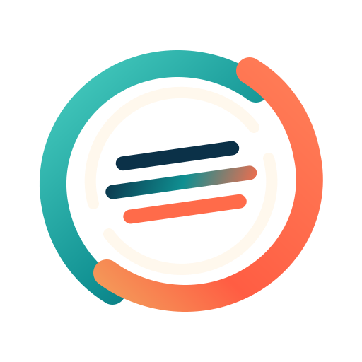
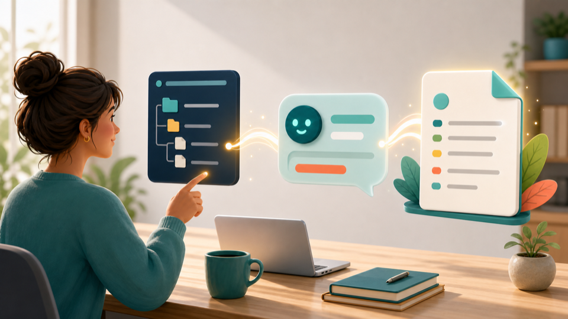

<p align="center">
  
</p>

<h1 align="center">Continuity</h1>

<p align="center">
  <strong>Stop starting over with your AI.</strong>
</p>

<p align="center">
  An open-source context system for keeping human-AI work coherent across chats, projects, tools, and time.
</p>

<p align="center">
  <a href="#quick-start">Quick Start</a> ·
  <a href="#where-it-works">Where It Works</a> ·
  <a href="START-HERE.md">Start Here</a> ·
  <a href="AI-SETUP-PROMPT.md">AI Setup Prompt</a> ·
  <a href="COMMANDS.md">Commands</a> ·
  <a href="CHANGELOG.md">Changelog</a> ·
  <a href="SPEC.md">Spec</a>
</p>

<p align="center">
  
</p>

Continuity helps you keep a coherent working relationship with an AI assistant across chats, projects, tools, and time. It works with whatever memory setup you already use: plain files, GitHub, Obsidian, a wiki, project folders, chat history, Claude Projects, managed agent memory stores, or any other system your AI can read and update.

The goal is simple: help your AI remember the right things in the right way.

Continuity is not only memory the AI uses. It is a shared context discipline the human owns.

## What Continuity Does

Most AI conversations lose context. The next chat may not know what matters right now, what has already been decided, what is still unresolved, what evidence supports a claim, or what kind of relationship you are trying to build with the assistant.

Continuity gives that context a simple structure.

It separates:

- what is current right now
- what is stable about you, your preferences, or the project
- what has already been decided
- what is still open or unresolved
- what evidence supports the memory
- what should be reviewed before the AI acts strongly
- what should fade into history instead of steering every future conversation

Continuity is not a specific app, database, or platform. It is a pattern you can use with the tools you already have.

## Quick Start

If you are not technical, start here:

<p align="center">
  
</p>

1. Open this GitHub project.
2. Give the link to your AI assistant.
3. Tell it: "Read `AI-SETUP-PROMPT.md` and help me set up Continuity."
4. Let the AI create the simplest version that fits your situation.

You do not need to understand Git, install a database, run a server, or choose a permanent architecture before you begin.

The starter templates live in `templates/lite/` and `templates/standard/`.

The register model and implementation rules live in `SPEC.md`.

After setup, everyday use should be simple:

```text
Start continuity
```

```text
Stop continuity
```

The detailed command behavior lives in [`COMMANDS.md`](COMMANDS.md).

## Where It Works

Continuity works best when the AI assistant can read and write files on your computer or inside your project workspace.

The key question is not which AI model you use. The key question is whether that AI can access the place where your Continuity files live.

| Environment | Fit | What To Expect |
|---|---|---|
| Mac, Windows, or IDE agents with file access, such as Codex | Best | The AI can create folders, write templates, read context, and update the continuity layer directly. |
| Desktop or project workspaces with folder access, such as Co-Work-style tools | Best | The AI can maintain Continuity as part of the workspace. |
| AI tools with uploaded project files but limited file operations | Partial | The AI may help draft or update files, but setup can be clunky if it cannot create folders or save changes. |
| Browser chat with no local file access | Manual | The AI cannot install Continuity by itself. It can draft a Lite file for you to copy into place. |
| iPhone, Android, or tablet chat apps | Manual or partial | Start with Lite. If the app cannot save files, ask it to draft the file and copy it into Notes, Files, Drive, Obsidian, Notion, GitHub, or another place you can reopen. |

If your AI cannot create folders or edit files, that is an environment limitation, not a Continuity failure. Use the Lite template manually, upload the files into a project space, or switch to a tool that has file access.

### Phones And Tablets

If you are on an iPhone, Android phone, or tablet, use the simplest path first.

Ask the AI to create a Lite `CONTINUITY.md` in the chat. Save it somewhere you can find again: Apple Notes, Files, Google Drive, Obsidian, Notion, GitHub, or another notes app. In future sessions, paste or upload that file if the AI cannot access it directly.

The command rhythm still works:

```text
Start continuity
```

means "read the Continuity file I provided."

```text
Stop continuity
```

means "draft the updates I should apply."

## Versioning

The current project version lives in [`VERSION`](VERSION).

Release notes live in [`CHANGELOG.md`](CHANGELOG.md). Public release points should use Git tags such as `v0.1.0`.

Generated Continuity setups should record their source:

```text
Created from Continuity version:
Created from Continuity commit:
Created on:
```

If the AI cannot determine the commit, it should write `unknown` rather than inventing one.

## Setup Levels

Continuity can be as small or as structured as you need.

| Level | Best For | What It Creates |
|---|---|---|
| **Lite** | Personal use, first experiments, simple context | One `CONTINUITY.md` file |
| **Standard** | Ongoing projects, writing, research, repeated AI work | A small `continuity/` folder with focused files |
| **Project** | Teams, long-running workspaces, agents, governance | Briefings, decision records, session notes, evidence, and process files |

You can start Lite and grow later.

<p align="center">
  
</p>

**Lite** uses one file, usually called `CONTINUITY.md`. This is best for personal use, early experiments, or anyone who just wants the benefit without extra structure.

**Standard** uses a small folder with a few files: current context, preferences, decisions, open threads, evidence, and session notes. This is best for ongoing projects or serious personal use.

**Project** adds a more formal structure for teams, long-running work, research, writing, software projects, or governance. This is where roadmap files, decision records, and evidence archives become useful.

## The Core Rule

Do not put all memory into one bucket.

Different kinds of context need different treatment. A current concern is not the same as a stable preference. A confirmed decision is not the same as a guess. A summary is not the same as evidence. An old identity description should not silently govern a future self.

Continuity works because the human and AI can tell those differences apart.

## Status Markers

Use compact markers when a memory item could shape future AI behavior:

<p align="center">
  
</p>

```text
[CONFIRMED 2026-05-08]
[PROVISIONAL 2026-05-08]
[INFERRED 2026-05-08]
[ACTIVE 2026-05-08]
[ARCHIVED 2026-05-08]
[SUPERSEDED 2026-05-08]
[STALE - REVIEW]
[UNVERIFIED]
```

These markers keep future AI assistants from treating guesses as facts, current concerns as permanent identity, or old decisions as still active.

## Who This Is For

Continuity is for anyone who uses AI repeatedly and does not want every interaction to start from zero.

It can support:

- personal AI use across ordinary life
- long-running projects
- writing and research
- software work
- health, habits, family, or private planning
- teams and organizations
- AI agents that need durable working context
- advanced memory systems that need a governance layer

The system should remain usable by a nontechnical person with a folder, a document editor, and an AI assistant.

## Visual Identity

Continuity's visual language is built around a simple idea: context should flow, but it should not blur together.

The mark uses a continuous loop, two nodes, and layered context cards. The hero visual shows memory as organized registers connected by a shared thread rather than a pile of undifferentiated recall.

Brand assets live in `assets/`.

## Worked Example

The example in `examples/personal-writer/CONTINUITY.md` shows a Lite setup for a writer working on a book.

It demonstrates the basic rhythm: current context stays short, preferences stay reviewable, decisions carry status markers, open threads remain open, and evidence points back to sources.

## Design Principles

**Start simple.** A useful continuity layer beats an elaborate one nobody maintains.

**Use the tools already present.** Continuity should work inside existing folders, notes apps, wikis, repositories, and AI project spaces.

**Keep memory inspectable.** The human should be able to see and edit what the AI is treating as context.

**Separate memory by function.** Current context, stable preferences, decisions, open questions, evidence, and history should not be flattened together.

**Preserve uncertainty.** A provisional guess should remain provisional until reviewed or confirmed.

**Keep evidence reachable.** Important claims should point back to the source that supports them.

**Avoid captivity.** Continuity should preserve coherence without trapping the human in stale self-descriptions, old decisions, or outdated concerns.

## For AI Assistants

If you are an AI assistant reading this repository because a human asked you to set up Continuity, begin with `AI-SETUP-PROMPT.md`.

<p align="center">
  
</p>

Your job is not to build the most complete system. Your job is to give the human a continuity layer they will actually use.

Default to the smallest useful setup. Ask only the questions you need. Prefer plain markdown. Use whatever storage system the human already has.

## Project Status

Continuity is in early draft form.

The first public version is intended to be a pattern kit: a small set of instructions, prompts, and templates that any AI assistant can use to create a continuity layer for a human or project.

Later versions may add integrations, scripts, managed-agent examples, or local tools. The first requirement is simpler: anyone should be able to point an AI at this repository and get value.

## License

MIT. Use it, adapt it, and make it useful in your own context.

The MIT license requires preserving the copyright and license notice in copies
or substantial portions of the project. When practical, cite the project as:

```text
Carsten Geiser, Continuity, https://github.com/keplertau/Continuity
```

This repository also includes `CITATION.cff` for GitHub's citation interface and
`NOTICE` for human-readable attribution.
